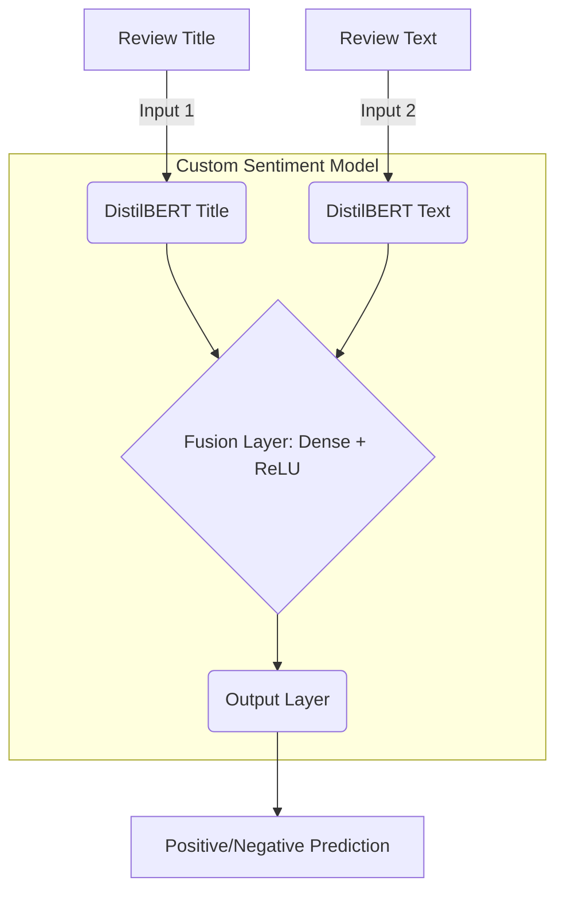

# 📌 Dual-Input Sentiment Analysis System (DistilBERT + Flask)

This project implements a fast and highly accurate sentiment analysis system that determines whether a product review is Positive or Negative. It achieves superior performance by leveraging a custom neural network architecture that fuses embeddings from two separate DistilBERT transformers—one for the Review Title and one for the Review Text.

The system is deployed as a real-time prediction service using a lightweight Flask web application.

## 🚀 Features

### 🔍 Dual-Input Sentiment Analysis

The core innovation is the dual-input architecture, which captures nuanced sentiment from both short (title) and long (review text) contexts:

  * **DistilBERT \#1:** Encodes the **Review Title**.
  * **DistilBERT \#2:** Encodes the **Review Text**.
  * The resulting embeddings are **concatenated and fused** in a custom neural network layer, leading to improved accuracy over single-input models.

### 🧠 Transformer-Powered

The system is built on state-of-the-art Natural Language Processing (NLP):

  * Uses **HuggingFace DistilBERT** pre-trained models.
  * The models are **fine-tuned** specifically for binary sentiment classification (Positive/Negative).

### 🕸️ Flask-Based Deployment

Provides a simple, clean, and efficient REST API for real-time predictions.

  * **Endpoint:** `/predict`
  * **Data Format:** Accepts JSON input for seamless integration.

### ⚡ Fast and Lightweight

Performance is prioritized:

  * **DistilBERT** is naturally smaller and faster than models like BERT.
  * The system ensures **fast inference** (under 200ms) even when running on CPU environments.

## 🏗️ System Architecture

The custom model is a clear example of transfer learning combined with a fused-feature network:



## 📦 Tech Stack

| Component | Technology | Role |
| :--- | :--- | :--- |
| **NLP Models** | DistilBERT (HuggingFace) | Core sentiment feature extraction |
| **Backend API** | Flask | Lightweight RESTful deployment |
| **Neural Network** | PyTorch / TensorFlow (Specify which one for better clarity) | Framework for custom fusion layer and training |
| **Tokenization** | HuggingFace Tokenizers | Efficient text preprocessing |
| **Data Format** | JSON | Standard API communication |

## 🧪 API Usage

The system exposes a single POST endpoint for predictions.

**POST** `/predict`

### Example Request

```json
{
  "title": "Worst purchase ever",
  "review": "The product stopped working within 2 days! I need a refund immediately."
}
```

### Example Positive Response

```json
{
  "prediction": "Negative"
}
```

## 📈 Model Performance

The dual-input approach significantly boosts classification quality:

| Metric | Score | Note |
| :--- | :--- | :--- |
| **Accuracy** | \~92% | High overall classification rate |
| **Precision** | High | Low false positive rate |
| **Recall** | High | Low false negative rate |
| **Inference Time** | \<200ms on CPU | Ideal for real-time applications |

## 🚀 How to Run the Project

Follow these steps to get the server running locally:

### 1️⃣ Clone the Repository

```bash
git clone <https://github.com/Shady0077/Sentiment-Analysis>
cd sentiment-analysis
```

### 2️⃣ Install Dependencies

```bash
pip install -r requirements.txt
```

### 3️⃣ Start the Flask App

```bash
python app.py
```

The Flask server will be accessible at:
👉 **`http://127.0.0.1:5000/`**

## 📁 Project Structure

```
sentiment-analysis/
│
├── app.py              # Flask server, API endpoint, and model loading
├── model.py            # Combined DistilBERT architecture and custom NN
├── requirements.txt    # Project dependencies
├── static/             # CSS/JS for potential simple UI
├── templates/          # HTML templates for the UI
└── README.md           # Project documentation
```

## ✨ Future Improvements

The project is built for expansion. Potential future work includes:

  * **Multimodal Inputs:** Integrate audio or image analysis to support richer data types.
  * **Advanced Deployment:** Deploy on cloud services (AWS / Render / Railway) for global scalability.
  * **LLM Verification:** Add a final **LLM-based sentiment verifier** to cross-check ambiguous predictions.
  * **Multilingual Support:** Fine-tune models for other languages.
  * **UI Dashboard:** Create a simple UI with charts for monitoring prediction history.

## 👨‍💻 Author

**Manas Upadhyay**

*Sentiment Analysis • NLP • Deep Learning • Flask Apps*
